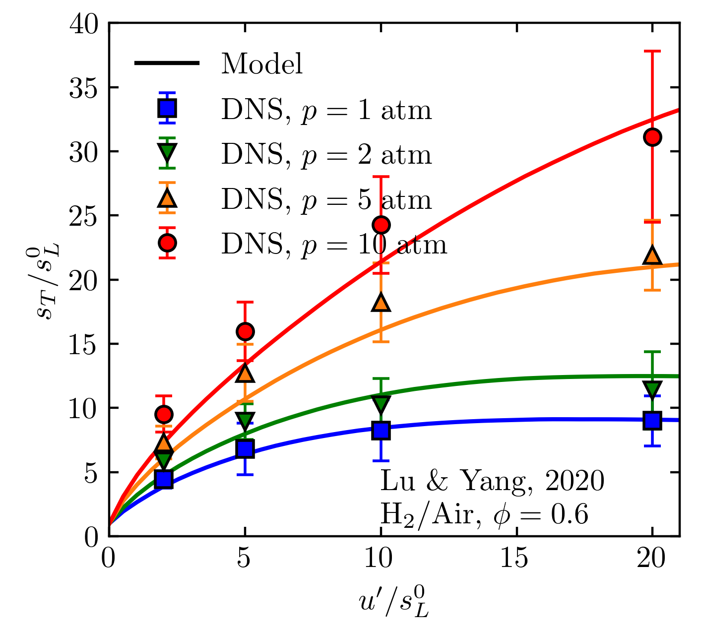
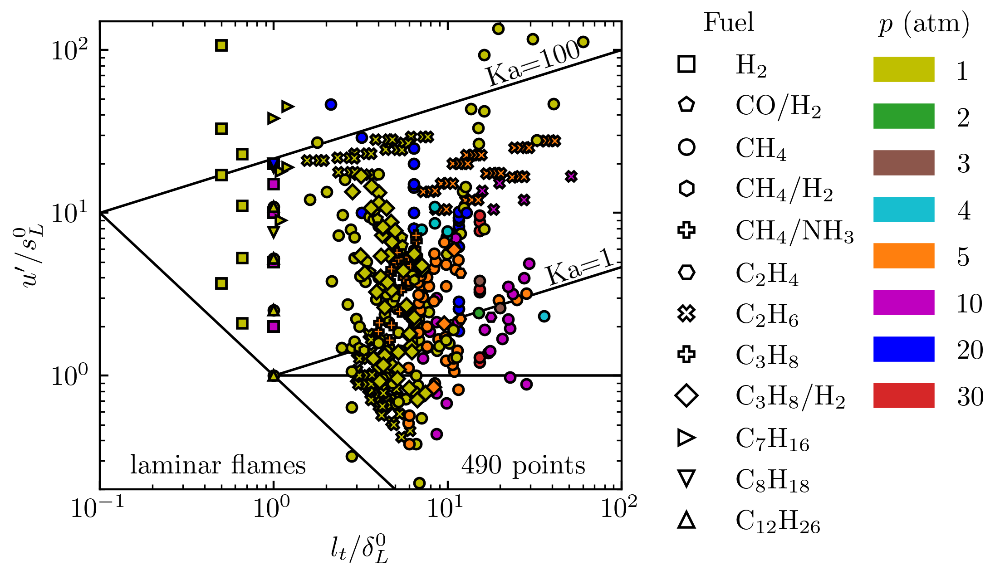
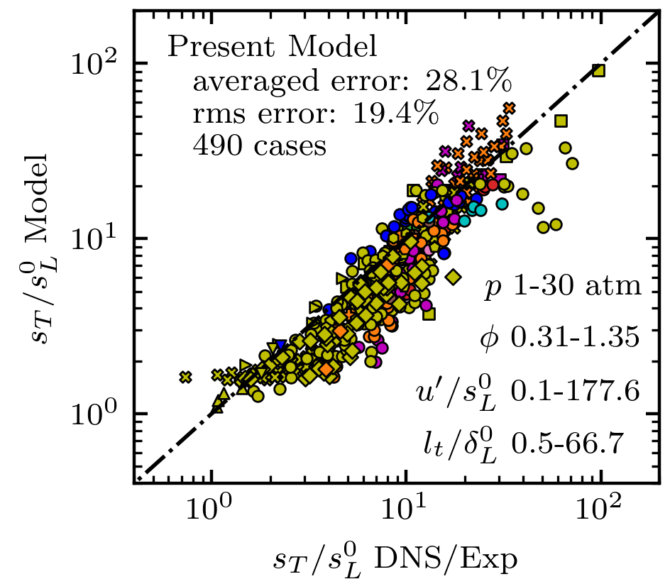

# STmodel
A predictive model of the turbulent burning velocity for planar and Bunsen flames over a wide range of conditions

Model predictions on turbulent burning velocity of lean hydrogen flames at different pressures, with DNS data from [Lu & Yang, 2020](https://doi.org/10.1016/j.proci.2020.06.162)

Validation cases:

Model predictions for the 285 cases:

Usage can be found in /examples for hydrogen and methane cases

# Cite
Lu and Yang, A predictive model of the turbulent burning velocity for planar and Bunsen flames over a wide range of conditions, 2021, in preparation.
